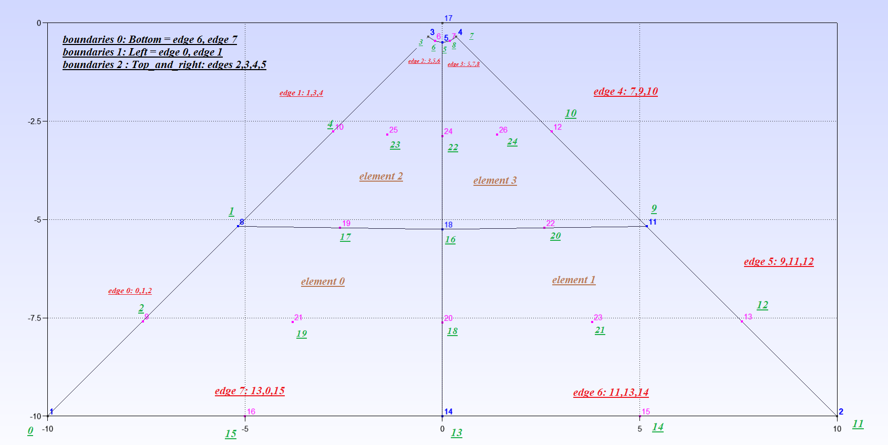

# gmsh-reader
C++ application for reading a GMSH mesh file

## Build
Using CMake, build with the following commands.

    mkdir build
    cd build
    cmake -DCMAKE_BUILD_TYPE=Release ..
    make

## Run
Run it on one of the data files in `../data/`.

    ./gmsh-reader.bin ../data/mesh_file.msh
    ./gmsh-reader.bin ../data/tutorial4Backup.msh

The second command will read the mesh pictured below.

Or, generate an annular mesh with the following command.

    module load gmsh
    gmsh -2 -format msh4 -o out.msh data/annular_structured.geo
    gmsh -2 -format su2 -o out.su2 data/annular_structured.geo

This code will only read 4.1 ASCII version `.msh` files, these are written by recent versions of [gmsh](https://gmsh.info/).

## Notes
A clever method to set the `Progression` in a gmsh script is given by this blog post: (https://afqueiruga.github.io/simulation/2018/08/21/geometric-progression-for-meshes.html)

## Credits
Most code is by Mohammad Haji <mhajit@gmail.com>. Snippits by Mark Stock <markjstock@gmail.com> and https://stackoverflow.com/users/763305 .
